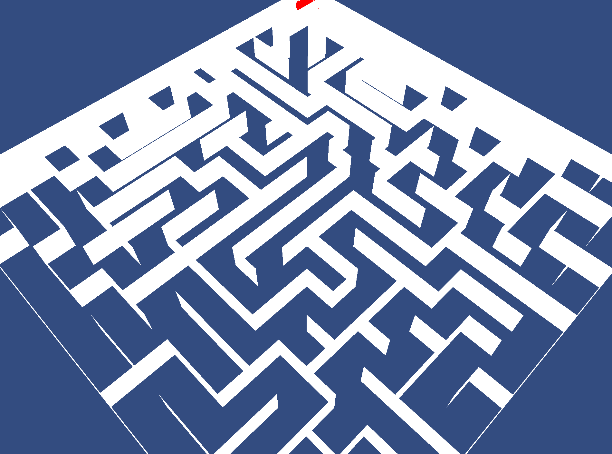

# MazeRunner
A simple maze running game using OpenGL for rendering.

## General Info
MazeRunner is a simple game, make in c++, that creates a maze using an iterative approach for maze generation. For rendering, 
OpenGL is used. The game starts with the user being able to choose a size for the maze, and then generate the maze.
The player will spawn at the far end of the maze, and at the opposite end, there will be a large red sphere, where when
the player approaches, will display a screen showing time it took to reach, and the ability to go to the main menu, or 
go exit. 

MazeRunner makes use of [glfw](https://www.glfw.org/) for window creating and events. Glew is used for handling OpenGL bindings.
[ImGui](https://github.com/ocornut/imgui) is used for gui rendering.